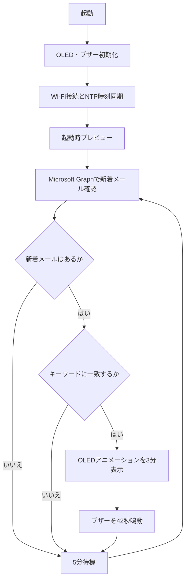

# DP192 デジタルホン・メールアラート

[](https://docs.espressif.com/projects/arduino-esp32/en/latest/)
[](https://learn.microsoft.com/graph/)
[](https://youtu.be/STJVEMpMfwk)

> **1996年の携帯電話を、現代のメールアラート端末として再生する。**
>
> 本プロジェクトは、デジタルホン／デジタルツーカー **DP192／タイプND** の筐体に Seeed Studio XIAO ESP32-C3、OLED ディスプレイ、パッシブブザーを組み込み、Microsoft 365 のメール受信を知らせるデバイスとして再生するものです。DP192 は1996年度グッドデザイン賞の受賞製品です。[1]

<p align="center">
  <a href="https://youtu.be/STJVEMpMfwk">
    
  </a>
</p>

<p align="center"><strong>画像をクリックすると制作動画を再生します。</strong></p>

## 概要

サービスを終了した携帯電話を、そのまま電話として復活させるプロジェクトではありません。DP192の筐体を活かしつつ、Wi-Fi 経由で Microsoft Graph API を定期的に呼び出し、監視対象メールボックスに新着メールがあれば、OLED のアニメーション表示とブザーで通知する IoT デバイスです。

スケッチは起動時に Wi-Fi と NTP 時刻同期を行い、以後は前回確認時刻以降のメールを確認します。通知対象をキーワードで絞り込むこともでき、空文字のままにすればすべての新着メールを対象にできます。メールを既読に変更しないため、同じメールを別のクライアントや監視装置からも確認できます。

| 項目 | 実装内容 |
| --- | --- |
| 通信・認証 | Wi-Fi、Microsoft Entra ID のクライアント資格情報フロー、Microsoft Graph API |
| メール確認 | **5分ごと**に前回確認時刻以降のメッセージを取得。1回あたり最大10件を処理 |
| 通知 | OLEDを**3分間**表示し、パッシブブザーを**42秒間**鳴動 |
| 表示 | メール確認時に「メールチェック中」を2秒間表示。通知時はビットマップとテキストを交互にアニメーション表示 |
| 初回確認 | 起動後にOLEDとブザーを10秒間動かし、配線・動作確認を実施 |
| OLED互換性 | I²C アドレス `0x3C` / `0x3D` を探索。SH1106を既定とし、SSD1306にも切替可能 |

## 制作動画

本プロジェクトの制作過程と実機の動作は、以下の動画で紹介しています。

[**【魔改造】30年前のデジタルホンの携帯電話にESP32を移植して現代に復活させる**](https://youtu.be/STJVEMpMfwk)

## ハードウェア

### 使用部品

| 部品 | 用途 | 備考 |
| --- | --- | --- |
| デジタルホン／デジタルツーカー DP192／タイプND | 外装・筐体 | 1996年度グッドデザイン賞受賞製品。[1] |
| Seeed Studio XIAO ESP32-C3 | 制御・Wi-Fi通信 | Arduino IDEで `XIAO_ESP32C3` を選択して書き込みます。[2] |
| 1.3インチ 128×64 I²C OLED | 通知画面 | SH1106系を既定にしています。SSD1306系の場合はスケッチの定義を切り替えてください。 |
| パッシブブザーモジュール | 音による通知 | スケッチは `tone()` を用いてメロディを鳴らします。 |
| USB Type-C 給電部材 | 電源供給 | 実装方法は使用するクレードル・筐体の状態に応じて設計してください。 |

部品の型式・電圧仕様は販売時期やロットにより異なる場合があります。必ず手元の部品の仕様書を確認し、短絡・逆接続・過電流が起きないように作業してください。

### 配線

スケッチで使用するピンは以下のとおりです。XIAO ESP32-C3 では `D4 = GPIO6`、`D5 = GPIO7`、`D10 = GPIO10` に対応します。[2]

| XIAO ESP32-C3 | 接続先 | 説明 |
| --- | --- | --- |
| `5V` | OLED `VCC` | OLED用電源 |
| `GND` | OLED `GND` / ブザー `GND` | 共通GND |
| `D4` / `GPIO6` | OLED `SDA` | I²Cデータ |
| `D5` / `GPIO7` | OLED `SCL` | I²Cクロック |
| `3V3` | ブザー `VCC` | ブザー用電源 |
| `D10` / `GPIO10` | ブザー信号端子 | ブザー制御 |

> **注意:** OLEDモジュールの電源電圧と信号レベルは製品ごとに確認してください。また、実機の筐体加工・はんだ付け・給電経路の改造は自己責任で行ってください。本リポジトリは携帯電話の通信機能やサービスを復旧するものではありません。

## ソフトウェア構成

```text
Release_CorporateSlaveDigitalPhoneDP192/
├── ESP32-C3/
│   ├── CorporateSlaveDigitalPhoneDP192_ESP32C3/
│   │   ├── CorporateSlaveDigitalPhoneDP192_ESP32C3.ino  # メインスケッチ
│   │   └── yukkuri_face.h                               # OLED表示用ビットマップ
│   └── 生成AIのmanusへOLEDとブザーのサンプルプログラムを本体に組み込む時に利用したプロンプト.txt
└── README.md
```

| 区分 | ライブラリ | 用途 |
| --- | --- | --- |
| ESP32標準 | `WiFi.h`、`HTTPClient.h`、`Wire.h`、`time.h` | Wi-Fi接続、HTTPS通信、I²C、NTP時刻同期 |
| 追加導入 | `ArduinoJson.h` | Microsoft Graph APIのJSONレスポンス解析 |
| 追加導入 | `U8g2lib.h` | 128×64 I²C OLEDの描画 |

## セットアップ

### 1. Arduino IDE とボード定義を準備する

Arduino IDE に ESP32 のボードパッケージを導入し、ボードとして **`XIAO_ESP32C3`**、接続したシリアルポートを選択します。公式の入門ガイドには、ボードパッケージの導入方法、ボード選択、書き込みに関する手順が掲載されています。[2]

ライブラリマネージャーから次の2つを追加してください。`WiFi.h`、`HTTPClient.h`、`Wire.h`、`time.h` は ESP32 Arduino コアに含まれます。

| ライブラリ名 | 検索語 | 用途 |
| --- | --- | --- |
| ArduinoJson | `ArduinoJson` | APIレスポンスのJSON解析 |
| U8g2 | `U8g2` | OLEDの描画 |

### 2. Microsoft Entra ID アプリを登録する

このスケッチは、ユーザーが操作せずにバックグラウンドで Microsoft Graph を呼び出す **クライアント資格情報フロー**を使用します。そのため、Microsoft Entra ID でアプリ登録を行い、アプリケーション ID、テナント ID、クライアント シークレットを取得します。アプリケーション権限を使う場合は、管理者による同意が必要です。[3]

Microsoft Graph の **Application permissions** として `Mail.Read` を設定し、管理者の同意を付与してください。スケッチは `bodyPreview` を取得するため、本文・プレビューを取得できない `Mail.ReadBasic.All` では要件を満たしません。`/users/{userPrincipalName}/messages` をアプリケーション権限で呼ぶ場合、`Mail.Read` は必要な権限の一つです。[4] [5]

> **重要:** `Mail.Read` のアプリケーション権限は、サインインユーザーなしでメールを読み取れる強い権限です。まずは専用の検証用メールボックスで動作を確認し、組織のセキュリティ方針に従ってください。Exchange Online の Application RBAC では、アプリがアクセスできるメールボックスをリソース単位で制限できます。[6]

### 3. スケッチに環境固有の値を設定する

Arduino IDE で [`CorporateSlaveDigitalPhoneDP192_ESP32C3.ino`](ESP32-C3/CorporateSlaveDigitalPhoneDP192_ESP32C3/CorporateSlaveDigitalPhoneDP192_ESP32C3.ino) を開き、次の定数を手元の環境に合わせて更新します。

```cpp
const char* SSID = "Wi-FiのSSID";
const char* PASSWORD = "Wi-Fiのパスワード";

const char* TENANT_ID = "Microsoft EntraテナントID";
const char* CLIENT_ID = "アプリケーション（クライアント）ID";
const char* CLIENT_SECRET = "クライアントシークレット";
const char* MAILBOX_ADDRESS = "monitor@example.com";

const char* ALERT_KEYWORD = "障害";  // 空文字なら全メールを通知
```

設定値の意味は以下のとおりです。

| 定数 | 設定内容 |
| --- | --- |
| `SSID` / `PASSWORD` | 接続するWi-Fiの認証情報 |
| `TENANT_ID` | Microsoft Entra ID のディレクトリ（テナント）ID |
| `CLIENT_ID` | 登録したアプリケーション（クライアント）ID |
| `CLIENT_SECRET` | アプリケーションのクライアントシークレット値 |
| `MAILBOX_ADDRESS` | 監視するメールボックスのメールアドレスまたはUPN |
| `ALERT_KEYWORD` | 件名または本文プレビューに含まれる通知対象キーワード。空文字なら全新着メールを対象にします。 |

> **機密情報の取り扱い:** Wi-Fiパスワード、クライアントシークレット、メールアドレスを設定した `.ino` ファイルは公開リポジトリへコミットしないでください。誤って公開した場合は、ただちにシークレットを無効化・再発行してください。

### 4. OLEDドライバーを確認する

既定では SH1106 用の定義が有効です。画面が表示されない場合は、該当箇所を切り替えて SSD1306 を試してください。

```cpp
// 既定: SH1106
U8G2_SH1106_128X64_NONAME_F_HW_I2C oled(U8G2_R0, U8X8_PIN_NONE);

// SSD1306系OLEDを使う場合はこちらを有効化
// U8G2_SSD1306_128X64_NONAME_F_HW_I2C oled(U8G2_R0, U8X8_PIN_NONE);
```

### 5. 書き込みと動作確認を行う

配線を確認してからスケッチを書き込み、シリアルモニタを **115200 bps** で開きます。起動後はWi-Fi接続、NTP同期、10秒間の初期化待機を経て、OLEDとブザーのプレビューが動作します。その後、最初のメール確認を実行します。

OLEDが見つからない場合、スケッチは `0x3C` と `0x3D` を確認します。シリアルモニタに `OLED was not detected` と表示される場合は、SDA/SCL、電源、GND、OLEDドライバー種別を順に確認してください。

## 動作フロー



通知対象を絞り込む場合、`ALERT_KEYWORD` に文字列を指定してください。キーワード比較は件名と本文プレビューに対して大文字・小文字を区別せずに実行されます。キーワードを空文字にすると、確認した新着メールはすべて通知対象になります。

## カスタマイズ

挙動はスケッチ先頭付近の定数で変更できます。まずは短い時間に設定して机上で動作確認し、運用時の値へ戻すことをお勧めします。

| 定数 | 既定値 | 役割 |
| --- | ---: | --- |
| `CHECK_INTERVAL` | `300000` ms | メール確認間隔（5分） |
| `OLED_ON_DURATION` | `180000` ms | OLEDを表示し続ける時間（3分） |
| `BUZZER_DURATION` | `42000` ms | ブザーを鳴らす時間（42秒） |
| `ALERT_KEYWORD` | `""` | 通知対象を絞るキーワード。空文字で全新着メール |
| `SCROLL_TEXT` | `"ゆっくりしていってね!!!"` | OLEDでスクロール表示するテキスト |
| `BPM` | `158.000764` | ブザーのメロディテンポ |
| `REPEAT_WAIT_MS` | `3000` ms | メロディを繰り返す前の待機時間 |

## 制約と注意事項

| 項目 | 内容 |
| --- | --- |
| 対応メールサービス | 現在のスケッチは Microsoft Graph API を利用するため、Microsoft 365 / Exchange Online 向けです。Gmail等へそのまま接続することはできません。 |
| メール検索範囲 | `receivedDateTime` による時刻フィルターを使い、`$top=10` で最大10件を取得します。高頻度の受信環境では、要件に合わせてページングや絞り込みの実装を追加してください。 |
| 既読状態 | メッセージの更新処理は行わないため、取得したメールを既読にはしません。 |
| 資格情報 | クライアントシークレットをスケッチに保持する構成です。個人検証・ホビー用途を前提とし、機密性の高い本番運用には適しません。 |
| 筐体加工 | 旧端末の分解・加工や電源改造には故障・けが・発熱のリスクがあります。所有権、法令、部品仕様を確認したうえで自己責任で実施してください。 |

## 参考リンク

- [DP192／タイプND — GOOD DESIGN AWARD ギャラリー](https://www.g-mark.org/en/gallery/winners/9ceb71d1-803d-11ed-862b-0242ac130002?companies=43280d13-c8b8-49d7-b503-0043e8dfc0b9&years=1996)
- [Seeed Studio XIAO ESP32-C3 入門ガイド](https://wiki.seeedstudio.com/XIAO_ESP32C3_Getting_Started/)
- [Microsoft Graph — ユーザーなしでアクセスする](https://learn.microsoft.com/en-us/graph/auth-v2-service)
- [Microsoft Graph — メッセージ一覧取得 API](https://learn.microsoft.com/en-us/graph/api/user-list-messages?view=graph-rest-1.0)
- [Microsoft Graph — アプリケーション権限のメールボックスアクセス制限](https://learn.microsoft.com/en-us/graph/auth-limit-mailbox-access)
- [IoT / IT 関連のYouTubeチャンネル](https://www.youtube.com/@regional-engineer)

## ライセンス

現時点では本リポジトリにライセンスファイルは含まれていません。ソースコード・同梱データの利用、再配布、改変、商用利用については、権利者へ確認してください。

## 参考文献

[1] [GOOD DESIGN AWARD, 「デジタルホン／デジタルツーカー DP192／タイプND」](https://www.g-mark.org/en/gallery/winners/9ceb71d1-803d-11ed-862b-0242ac130002?companies=43280d13-c8b8-49d7-b503-0043e8dfc0b9&years=1996)

[2] [Seeed Studio, *Getting Started with Seeed Studio XIAO ESP32C3*](https://wiki.seeedstudio.com/XIAO_ESP32C3_Getting_Started/)

[3] [Microsoft Learn, *Get access without a user*](https://learn.microsoft.com/en-us/graph/auth-v2-service)

[4] [Microsoft Learn, *List messages*](https://learn.microsoft.com/en-us/graph/api/user-list-messages?view=graph-rest-1.0)

[5] [Microsoft Learn, *Role Based Access Control for Applications in Exchange Online*](https://learn.microsoft.com/en-us/graph/auth-limit-mailbox-access)

[6] [Microsoft Learn, *Role Based Access Control for Applications in Exchange Online*](https://learn.microsoft.com/en-us/graph/auth-limit-mailbox-access)
